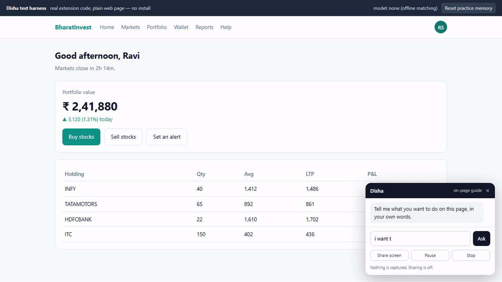
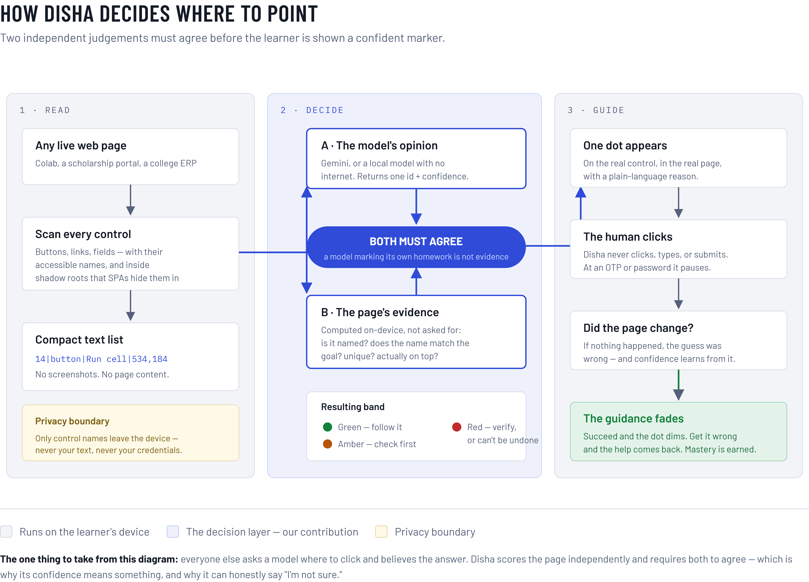
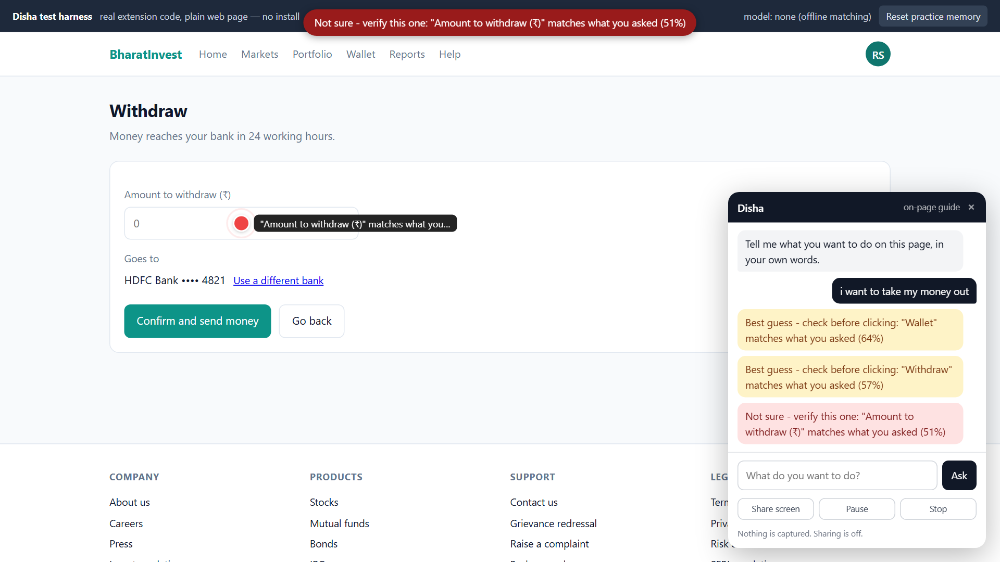

<h1>Disha दिशा — "direction"</h1>

### It points. You click. Then it stops pointing.

Type what you want to do, in your own words, on any web page. Disha puts a coloured dot on the
**one** control you should click next — and the colour is a confidence number it can be held to.
It never clicks for you. And the more times you succeed, the fainter the dot gets, until it is gone.

  
   
  <em>The real product, unedited — one goal typed in plain words, four steps, three screens.</em>

> **Positioning line, use it verbatim** — it survived the prior-art audit:
> *A confidence-aware, human-in-the-loop visual navigation copilot for Indian public-service and
> learning interfaces.*

**Nothing in this repository is a mock-up.** Every screenshot, every clip, every number came out of
the running code. Before you say something on stage, check it against [`deck/numbers.md`](deck/numbers.md).

---

## Where to go, by how much time you have

| You have | Do this |
|---|---|
| **30 seconds** | Watch the clip above. That is the product. |
| **2 minutes** | Double-click `run.bat`, type *"i want to take my money out"*, follow the dots to the red one. |
| **10 minutes** | Read [HOW-TO-DEMO.md](HOW-TO-DEMO.md) — the stage runbook, including what to say. |
| **You are presenting** | [HOW-TO-DEMO.md](HOW-TO-DEMO.md), then [judge-FAQ.md](judge-FAQ.md), then §5 below for what we may and may not claim. |
| **You are building the PPT** | [`deck/slides.md`](deck/slides.md) → [`deck/numbers.md`](deck/numbers.md) → [`media/clips/`](media/clips). |
| **You are changing the code** | §3 below, then open `prototype/guide-dots/`. |

---

## 1. Run it — one minute, no install

**Double-click `run.bat`.** That is the whole answer. It frees the ports, serves the files, opens the
portal, and prints every URL. Press any key in that window to shut everything down.

The only prerequisite is **Python on PATH** — and only to serve files over http, because a browser
will not run the guide from a `file://` page. Disha itself is plain JavaScript: nothing to install,
nothing to compile, no `npm install`, and no network call at all unless a model key is configured.

| URL | What it is |
|---|---|
| `localhost:8931/index.html` | **The portal** — the product page. Start a presentation here. |
| `localhost:8777/demo/index.html` | **The live prototype.** Type a goal, follow the dots. |
| `localhost:8931/practice.html` | The practice sandbox — a deliberately awkward, government-shaped portal. |
| `localhost:8778/how-the-dot-is-chosen.html` | The maths behind a single decision, animated. |

**Nervous about typing on stage?** `localhost:8777/demo/index.html?auto=1` plays the whole story
hands-free. One scene at a time: `&scene=chain` · `red-verify` · `nav` · `fade`.

---

## 2. What is in here

Six folders, and each one answers a different question.

| Path | What it holds | Open it when |
|---|---|---|
| **[`prototype/guide-dots/`](prototype/guide-dots)** | **The product.** An MV3 Chrome extension, plus a harness that runs the same code on a plain page with no install. | You are explaining or changing how it works |
| **[`media/`](media)** | **Every clip and screenshot**, in one place — four looping videos and eleven stills, all from the running prototype. | You need a picture or a video of Disha working |
| **[`deck/`](deck)** | **The presentation kit** — the writing. Final slide text, every number traced to its source, and the draft pptx and pdf. | You are building the PPT |
| [`platform/`](platform) | The portal, an architecture page, and the practice sandbox — three standalone HTML files. | You need the product page or an architecture visual |
| [`explainer/`](explainer) | One animated page walking through a single grounding decision, on the real measured numbers. | A judge asks *"how does the confidence actually work?"* |
| [`research/`](research) | **Our** three deep-research reports. Every number on the deck traces to a line in one of them. | You need a citation |
| [`reference/`](reference) | Material we did **not** write — the SIH catalogues, the guidelines, the official template, other teams' decks. **Gitignored: your clone will find it empty, and that is correct.** | You need the rules or the template — [its README](reference/README.md) says where to download each one again |

And the loose files at the root, all of them ours:

| File | What it is |
|---|---|
| [HOW-TO-DEMO.md](HOW-TO-DEMO.md) | The stage runbook: what to open, what to say, what to do when it breaks. |
| [judge-FAQ.md](judge-FAQ.md) | The Q&A bank. Killer questions, rehearsed, one sentence each. |
| [demo-video-script.md](demo-video-script.md) | Shot-by-shot script for the two-minute demo video. |
| [ATTRIBUTION.md](ATTRIBUTION.md) | What we borrowed, from where, under which licence — and what we deliberately did not read. |
| [next-prompts-for-opus.md](next-prompts-for-opus.md) | The AI-agent work queue — what is done, what is deferred, and why. |
| [PPT-content-draft.md](PPT-content-draft.md) | Earlier content blocks. Superseded by `deck/slides.md`; kept for background. |
| `run.bat` | The launcher. |

> **The dividing line, if you are ever unsure where something goes:** if we made it, it belongs in
> git. If we downloaded it and could download it again, it belongs in `reference/` and out of git.
> That rule already removed 272 MB of cloned repos and roughly 23 MB of PDFs from the tree.

---

## 3. How it actually works

  

There are two ways to run the same code — install it as a Chrome extension, or open the demo
harness in any browser. **The harness loads `lib/` and `content.js` unmodified**; it only shims the
four `chrome.*` calls a content script expects. So if it works in the harness, that is the shipping
code working, not a mock of it.

The loop, in order:

> **enumerate** what is on the page → **scrub** anything private out of the names → **ask** a model
> (or match offline) → **score** the answer against the page itself → **draw** one dot →
> **wait for the human to click** → repeat, a little more faintly each time.

| File | Lines | Its job |
|---|---|---|
| `lib/tree.js` | 137 | Enumerate every visible interactive element and keep **live** DOM references. Each gets a numeric id. |
| `lib/redact.js` | 72 | **The privacy boundary, in code.** A badly built portal will put a value into an element's accessible name, so an Aadhaar or account number can ride into the prompt. Names are masked to their *shape* — `Aadhaar «12-digit»` — before anything leaves the device. |
| `background.js` | 336 | The only thing that talks to a model; content scripts cannot make cross-origin calls. Gemini (free tier, default), Anthropic (BYOK), Ollama (local). Parses the replies models actually send — fenced, chatty, or clean. |
| `lib/local.js` | 148 | **The offline planner.** Matches your words to the page through a synonym table. No network, no key. Also the fallback when the model call fails, and capped below green on purpose. |
| `lib/ground.js` | 120 | **The honesty layer.** Scores the page itself — is the control named? unique? actually on top? does it share words with the goal? — and combines that with the model's own confidence using `min()`, so the number can never contradict the colour. |
| `lib/dots.js` | 640 | Draws the marker, and never intercepts a click. The dot **travels** from the previous step, morphs into a scroll arrow when the target is off screen, and shakes on a wrong click. |
| `lib/fade.js` | 62 | **The pedagogy layer.** Every clean repetition dims that step; a wrong click **restores** it. Fading is earned, never on a timer — fixed monotonic fading can be worse than none at all. |
| `lib/remember.js` | 138 | **Spaced practice.** A procedure you did once is not one you can do in three weeks, so a mastered step gets a review date instead of being marked done forever. FSRS-5, ported from `fsrs4anki` (MIT). |
| `lib/chat.js` | 159 | The ask bar, on the page, in a shadow root. It is not in the extension popup because a popup closes the instant you click the page — and clicking the page is the entire interaction. |
| `lib/screen.js` | 79 | Optional screen share for pages with no useful DOM — canvas, embedded PDF, cross-origin iframe — with a **track-level Pause** for OTP and PIN screens. |
| `content.js` | 289 | The loop that holds it all together. Also owns the 1.25-screen threshold that decides one arrowhead versus two. |
| `popup.js` / `popup.html` | 166 | Extension settings: provider, key, model. |

**Around it:** `demo/` holds a fictional broker portal, the `chrome.*` shim, and `autoplay.js`, which
drives the whole story hands-free — it types into the real ask bar, waits for the real dot, and
clicks through `elementFromPoint`, exactly as a hand would. It never plants an answer, so *a take
that looks right is right*. `test/` holds `realsite.mjs` (real enumeration against sites we do not
control, no model, **no clicks**), `record.mjs` (screen-records straight out of Chrome over CDP),
`cdp.mjs` (an entire DevTools Protocol client in one file, zero npm packages), and `parse.test.mjs`.

**To install it for real:** `chrome://extensions` → Developer mode → **Load unpacked** →
`prototype/guide-dots`. Set a provider in the popup. With no key at all it still runs, offline,
through `lib/local.js`.

---

## 4. Building the presentation

**Start at [`deck/slides.md`](deck/slides.md).** It is the final text, mapped box by box onto the six
official slides, with the template's own headings reproduced so nothing gets accidentally renamed —
and a *claims-we-must-NOT-make* checklist at the bottom.

Then:

- **[`deck/numbers.md`](deck/numbers.md)** — every statistic, traced to an exact source line in `research/`, plus an explicit list of the numbers we do **not** have. *If a number is not in this table, it does not go on a slide.*
- **[`deck/README.md`](deck/README.md)** — the official rules (max six slides including the title · upload PDF only · use the provided template unchanged), where the real template actually is, and five things not to get wrong.
- **[`media/clips/`](media/clips)** — four silent looping clips of the real product, 1080p30 H.264 with GIF fallbacks, each measured to loop seamlessly. Its README says which clip belongs on which slide.
- **[`media/screenshots/`](media/screenshots)** — eleven 1920×1080 PNGs, all captured from the running prototype. [`media/README.md`](media/README.md) says what each one shows.

> ⚠️ **The template in `research/` is the 2024 edition.** Download the **2026** file from the SIH
> portal and paste this text into that one. The section structure is unchanged, but the logo, the
> year and the footer have to come from the 2026 file.

---

## 5. What you can say on stage — and what you can't

  
   
  <em>Step three. Two controls scored almost the same, so it says so — in red, at 51%.</em>

**The measured run** (fictional broker portal, offline matcher, goal *"i want to take my money
out"*) is four steps across three screens:

  <b>amber 64%</b> &nbsp;→&nbsp; <b>amber 57%</b> &nbsp;→&nbsp; <b><code>red 51%</code></b> &nbsp;→&nbsp; <b>amber 75%</b>

Step three going red **is the pitch, not a bug.** `Confirm and send money` scored almost as well as
the amount field — 0.815 against 0.763, a margin of 0.052 — and a narrow win gets reported as a
narrow win.

**On sites nobody scripted** ([`deck/real-site-run.md`](deck/real-site-run.md)) — real enumeration,
no model, no clicks:

| Site | Controls found | Named | The dot would land on | Shown |
|---|---|---|---|---|
| scholarships.gov.in | 28 | 86% | **"Apply now" — correct** | red 30% |
| swayam.gov.in | 50 | 68% | a course tile — **wrong** | red 16% |
| aicte-india.org | 119 | 93% | "Search" — **partial** | red 54% |

That is the answer to *"is it hardcoded to your page?"* — a measurement rather than a claim. And
every miss was reported as a miss.

### Three things we do not claim

1. **A green dot.** No model key is configured, and the offline matcher is capped below green by design. We have never shown green, so we never say we have.
2. **An accuracy rate.** Three sites on one day is a sample, not a benchmark. Quote it in full or not at all.
3. **That we invented AI screen understanding.** Microsoft Copilot Vision already highlights where to click. **Keep that honesty line on slide 2** — removing it is the fastest way to lose the novelty argument the moment a judge names the product first. What nothing shipped combines is *calibrated, visible confidence* + *guidance that fades on demonstrated mastery* + *packs built for Indian student and public-service portals*.

Rehearsed one-sentence answers to everything else: **[judge-FAQ.md](judge-FAQ.md)**.

---

## 6. Status

**Built, and verified in a browser.** The four-step chain across three screens · the honest red band ·
the on-page ask bar · scroll arrows that distinguish *just past the edge* from *keep going* · the
proximity hover card · scaffold fading with restore-on-error · the offline planner · screen share
with a real Pause · travelling-dot motion · the live thinking-scan panel · hands-free autoplay ·
four looping clips · the deck package · and runs against three real government portals.

**Not built — say so plainly if asked.** The green dot and the live-model bands, both waiting on a
Gemini key · page Q&A · per-site knowledge packs · route preview (*"what comes after the click"*) ·
a vision consumer · the `05-pause` clip, which needs a hand recording because headless Chrome has no
desktop to capture · and `06-green`, which needs the key.

Everything else was deferred until after the intercollege round **by decision, not by accident** —
see [next-prompts-for-opus.md](next-prompts-for-opus.md).

---

## 7. Working notes

- **No build step, no dependencies.** Plain JavaScript, plain HTML. The `test/` scripts want Node 22+, and recording also wants Chrome on `--remote-debugging-port=9333` plus ffmpeg on PATH.
- **`borrowed/` is gone.** It held 272 MB of third-party repos; each has now either contributed code we credit or a recorded reason we rejected it, so the folder was deleted. See [ATTRIBUTION.md](ATTRIBUTION.md).
- **`reference/` is gitignored** and your clone will find it empty. That is correct — it holds only material we downloaded and can download again. [`reference/README.md`](reference/README.md) is tracked and lists every file with its source.
- **Secrets never go in git.** `.env*`, `*.key`, `config.local.js` and `research/agent router api key/` are all ignored. Keys live on disk only — put yours in `config.local.js` or the extension popup, never in a tracked file. **This repository is public.**
- **Ports** are 8777 (prototype), 8931 (portal), 8778 (explainer), also configured in `.claude/launch.json` for agent-driven runs.
- If a page looks stale, hard-reload it with Ctrl+F5 — the file servers set no cache headers.
